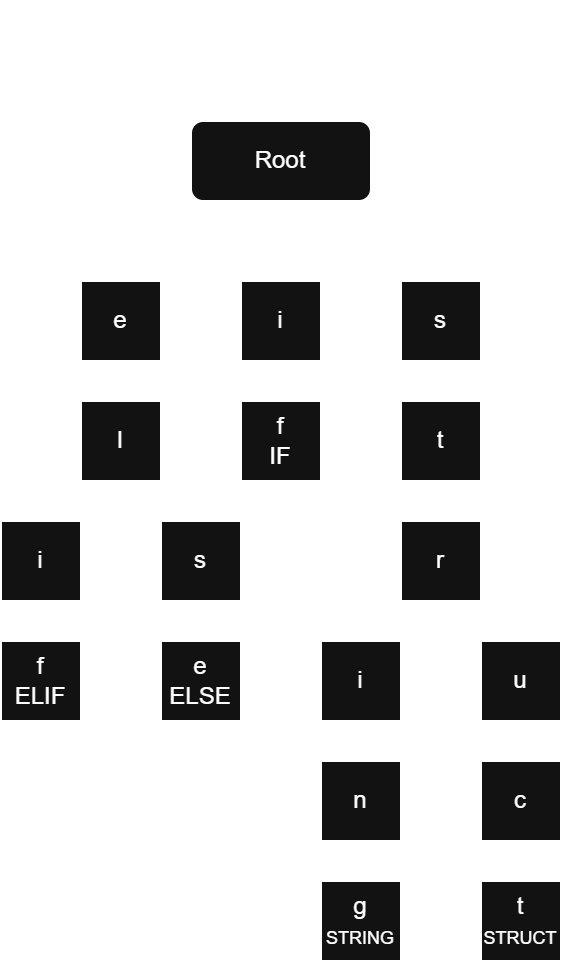

# The Trie
The "trie" is a data structure that will be used check if an identifier is a keyword and what `Token_Type` it corresponds to, more efficiently than a standard array comparison search while being more robust than my current hard-coded conditional method.

This data structure will be created from an array of keyword strings and there subsequent `Token_Type` in a struct. The array is sorted alphabetically by hand.
E.G.
```
KEYWORDS :: [?]Keyword_Identifier{
	{"elif",   ELIF},
	{"else",   ELSE},
	{"if",     IF},
	{"string", STRING},
	{"struct", STRUCT},
}
```
`init_trie` will be called with `init_parser` and would produce the following data structure based of the above array.

# Usage
After initialisation of the trie it will simply need to be traversed against an identifier and then return a `Token_Type` determined by whether that identifier was present in the trie.
This will be done with the following function.
```
trie_search :: proc(identifier: string) -> Token_Type {...}
```
If the identifier is found in the trie, then that keywords corresponding `Token_Type` (stored at the leaves of the trie) entry will be returned. If the identifier is not found to lead to a leaf, then `Token_Type.IDENTIFIER` will be returned.

## Pseudo Code:
### `init_trie(KEYWORDS)`
- node = root
- for keyword in KEYWORDS
	- for character in keyword
		- if character is last
			- if exists(character) in node
				- break
			- insert leaf with type
		- elif exists(character) in node
			- traverse to next node
		- else
			- insert new node
		 
### `trie_search(identifier)`
- node = root
- for character in identifier
	- if exists(character) in node
		- traverse to node
		- if node is leaf
			- return `leaf.type`
	- else
		- return `IDENTIFIER`
# Notes
While not as efficient as a map I still thought it would be something to include in this first prototype rendition of the language, because implementing new data structures is great practice and keeps my mind thinking and learning new things.